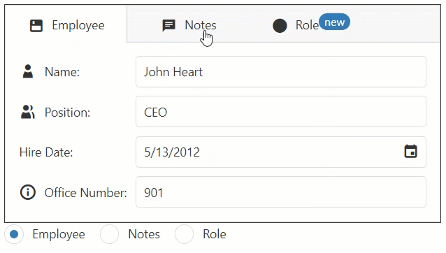

<!-- default badges list -->

<!-- default badges end -->
# DevExtreme TabPanel - Getting Started 

This repository stores the code examples of the TabPanel component for the [Getting Started with TabPanel](https://js.devexpress.com/Documentation/Guide/UI_Components/TabPanel/Getting_Started_with_TabPanel/) tutorial. This tutorial explains how to add a TabPanel to a page, create tabs, specify view content, and navigate between tabs.

## Files to Review

- **Angular**
    - [app.component.html](Angular/src/app/app.component.html)
    - [app.component.ts](Angular/src/app/app.component.ts)
- **jQuery**
    - [index.js](jQuery/src/index.js)
- **React**
    - [App.js](React/src/App.js)
- **Vue**
    - [App.vue](Vue/src/App.vue)

## Documentation

- [Getting Started with TabPanel](https://js.devexpress.com/Documentation/Guide/UI_Components/TabPanel/Getting_Started_with_TabPanel/)

- [TabPanel - API Reference](https://js.devexpress.com/Documentation/ApiReference/UI_Components/dxTabPanel/)
